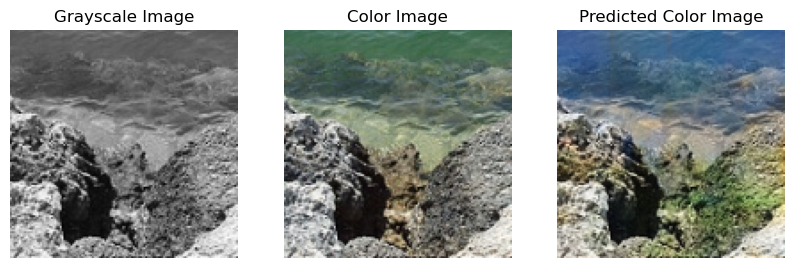

# Image Colorization using Deep Learning
This repository contains the code for a deep learning model that takes a gray-scale image as input and predicts the corresponding colored version of the image.

# Requirements
- Python 3
- TensorFlow 2
- Numpy
- Matplotlib
- opencv-python

# Dataset
The data set is from kaggle, Landscape color and grayscale images. This dataset consist of street, buildings, mountains, glaciers, trees etc and their corresponding grayscale images in two different folders. The main objective of creating this dataset is to create an autoencoder network that can colorize grayscale landscape images.

# Model Architecture
The model architecture consists of a convolutional neural network (CNN) with an encoder-decoder structure. The encoder consists of four convolutional layers with 128, 128, 256, and 512 filters, respectively, followed by batch normalization layers. The mid layer has 512 filters. The decoder consists of four transpose convolutional layers with 512, 256, 128, and 128 filters, respectively, followed by a final transpose convolutional layer with 3 filters (corresponding to the RGB channels). Skip connections are used between the encoder and decoder layers to improve the model's ability to capture details and prevent the vanishing gradient problem.

# Model Results

